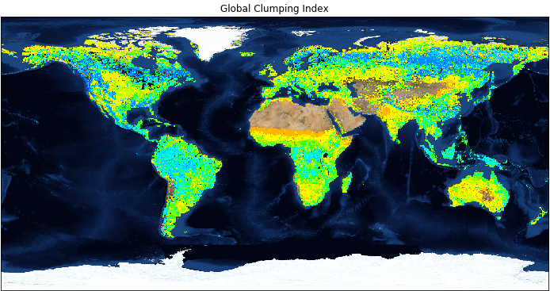

# Tutorial: Access ORNL DAAC WMS Service using Python
*Author: ORNL DAAC*
 
*Date: March 9, 2018*
 
*Contact for [ORNL DAAC](https://daac.ornl.gov/): uso@daac.ornl.gov*

##### Keywords:  SDAT, WMS, OGC Web Service, Python, `OWSLib`
## Overview
In this tutorial, we will explore how to access ORNL DAAC OGC WMS Service using python OWSLib library. OWSLib is a Python package for client programming with Open Geospatial Consortium (OGC) web service (hence OWS) interface standards, and their related content models. WMS provides a simple HTTP interface for requesting geo-registered map images from one or more distributed geospatial databases. The WMS request is also available from data downloading page of ORNL DAAC Spatial Data Access Tool (SDAT). After connecting to ORNL DAAC WMS service, we will list all available layers. For this example, global foliage clumping index Data derived from MODIS BRDF is used for demonstration. Then we will walkthrough how to get available metadata and operations of this WMS service layer. At last, we will learn how to send request to map the data and plot the legend.

## Source Data
The dataset of Global 500-m Foliage Clumping Index Data Derived from MODIS BRDF in 2006 is used in this example. The original GeoTIFF file is accessible from [ORNL DAAC's Spatial Data Access Tool.](https://webmap.ornl.gov/ogcdown/wcsdown.jsp?dg_id=1531_1)
## Prerequisites:
Python 2.7 or greater. Python package: `OWSLib`, `basemap`, `matplotlib`

## Procedure
Access the the tutorial here:  
[Tutorial](sdat_python_v1.ipynb)
